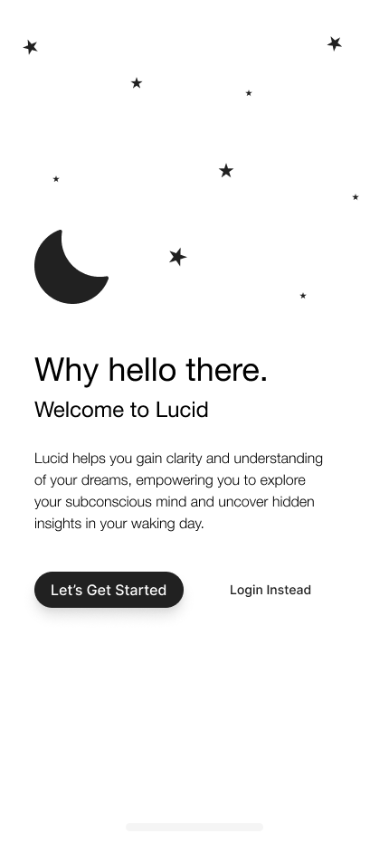
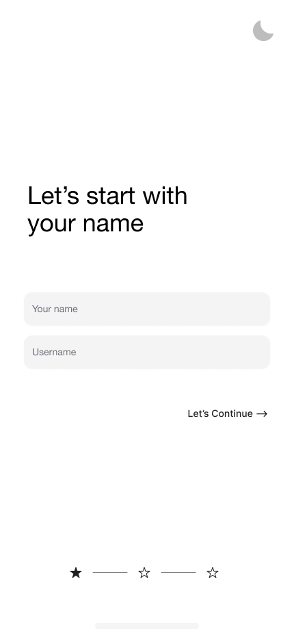
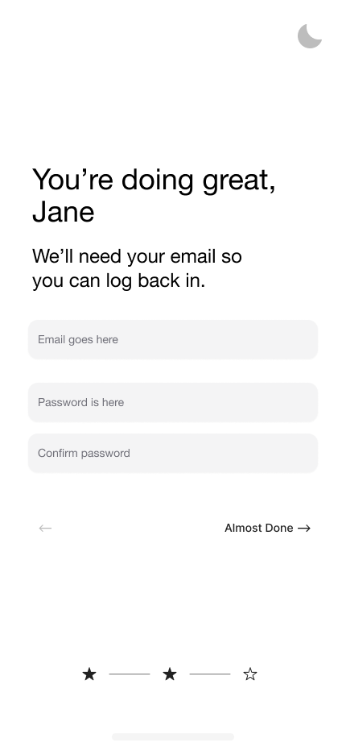
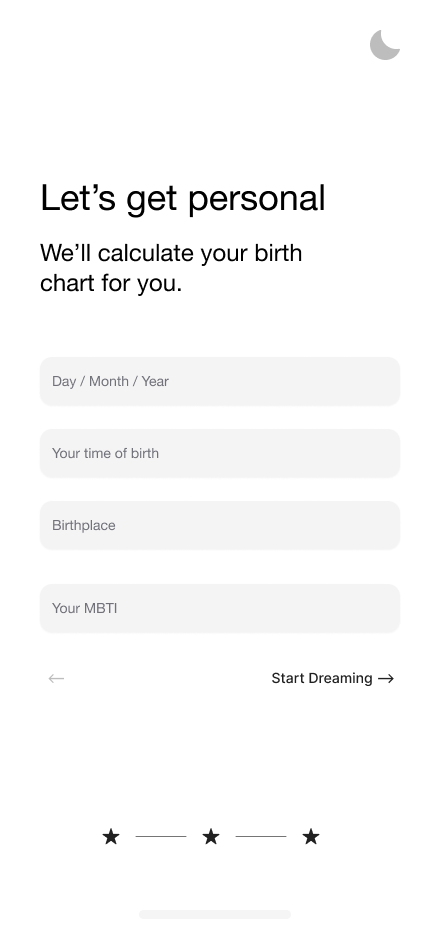
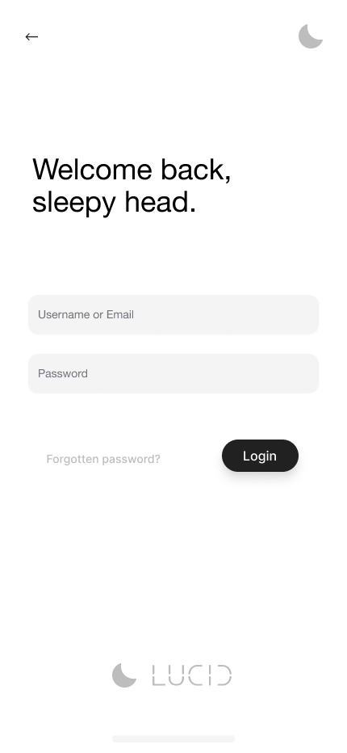
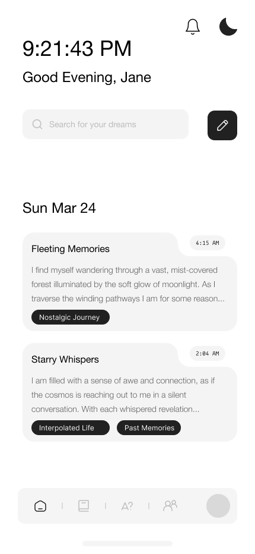
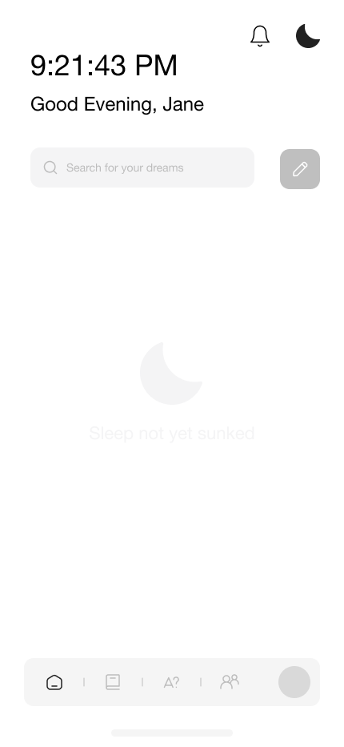
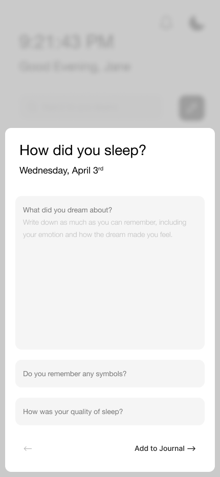
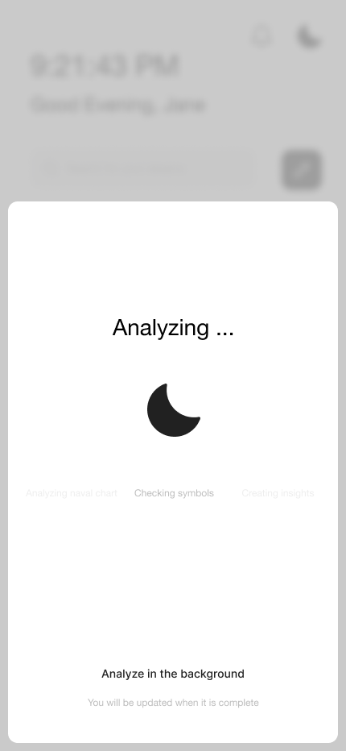
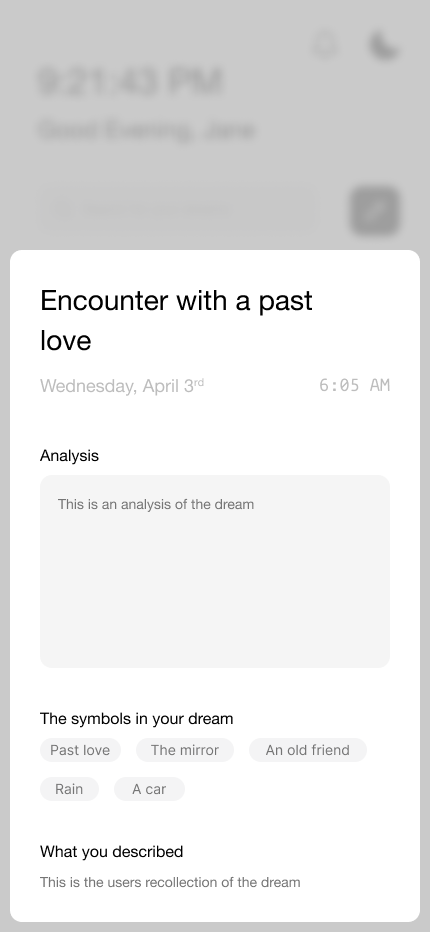

# Lucid

(im)proved dream journal.

## Overview

Lucid is a journal app for users to record your dreams, and provide a high level overview of the meaning of your dream based on your personality type and your birthchart.

### Problem

We only remember a fraction of our dreams, and even those slip away if we don't try to remember them.

So many of us check our phones first thing when we wake up to the sound of our alarm, some of us have a dream journal that we write in, some of us have dreams that haunt us throughout the day.

Dreams are often considered nonsensical, their narratives might not make much sense on the surface, however they often hint at emotions and feelings that we repress during our waking day.

Lucid is a healthier way to start your morning, by taking a moment to reflect on your rest and learn what your dreams could mean in your waking day.

### User Profile

* General users:
    * Looking to gain insights into their dreams.
    * Looking to remember their dreams for *lucid* dreaming.
    * Looking to start their morning on a healthier note, instead of *doom-scrolling*.
    * Looking to reflect back on their dreams and their meanings.
    * Looking to find deeper meaning of recurring symbols.

### Features

Lucid is a PWA journaling app that utilizes a generative AI and natural language processing to analyze your dreams, provide mood insights and provide intelligent engagement with thought provoking insights.

Access Lucid from anywhere, desktop or mobile.

Lucid takes your dream insights one step further, by taking into consideration your: MBTI, Naval Birth Chart to provide hyper personalized sentiment insights.

Lucid provides you a uniquely surreal image that is generated from the context of your dream, allowing you to preview your dream in another medium.

Lucid automatically sorts your dreams with unique tags, and allows you to edit these tags as you see fit for categorization.

Lucid helps you gain clarity and understanding of your dreams, empowering you to explore your subconscious mind and uncover hidden insights in your waking day.

Lucid automatically takes the most recurring symbols in your dream, and creates a personalized dictionary for you with the symbols and their meanings.

### Tech Stack

#### Frontend
* NextJs
* TypeScript
* Tailwind / NextUI
* Framer Motion

#### Backend
* NodeJs
* Express
* MySQL
* KnexJS
* bcrypt

### APIs

- Custom API with express for data storage
- S3 for Image Storage
- OpenAi ChatGPT for generative insights
- OpenAi Dall-E for image generation
- 

### Sitemap

* Onboarding Page
* Login / Register
* Dashboard
    * Dream entry modal
    * Dream analysis modal
* Symbol dictionary page
* Community form page
* Friends list / messages
* Settings page

### Mockups

#### Landing Page



#### Onboarding







#### Login



#### Dashboard











### Endpoints

#### /api/users

`/`
POST

Request:
```
{
    "email": "janedoe@example.com",
    "password": "password",
    "username": "janedoe",
    "mbti": "mbti",
    "dobYear": "1992-10-10",
    "dobLocation": "Switzerland",
    "dobTime": "5:30AM EST",
    "gender"?: "optional"
}
```

Response:
```
{
    "id": "uuid"
    "email": "janedoe@example.com",
    "username": "janedoe",
    "role": "user",
    "createdAt": "epoch",
    "updatedAt": "epoch"
    "token": "sometoken"
}
```

`/:userId`
GET, UPDATE, DELETE

Request:
```
{
    "email": "janedoe@example.com",
    "password": "password",
    "username": "janedoe",
    "mbti": "mbti",
    "dobYear": "1992-10-10",
    "dobLocation": "Switzerland",
    "dobTime": "5:30AM EST",
    "gender"?: "optional"
}
```

Response:
```
{
    "id": "uuid"
    "email": "janedoe@example.com",
    "username": "janedoe",
    "role": "user",
    "createdAt": "epoch",
    "updatedAt": "epoch"
    "token": "sometoken"
}
```

#### /api/dreams

`/:userId`
GET 

Response:
```
[
	{
    "id": "uuid"
    "user": "userId",
    "content": "the users recollection of the dream",
    "interpretation": "OpenAi's sentiment analysis",
    "symbols": "symbols, separated, by, commas",
    "context": "Dall-E image link uploaded to s3",
    "createdAt": "epoch",		
	}
]
```

`/:userId`
POST, UPDATE, DELETE 

Request:
```
{
    "user": "userId",
    "content": "the users recollection of the dream",
    "interpretation": "OpenAi's sentiment analysis",
    "symbols": "symbols, separated, by, commas",
    "context": "Dall-E image link uploaded to s3",
}
```

Response:
```
{
    "id": "uuid"
    "user": "userId",
    "content": "the users recollection of the dream",
    "interpretation": "OpenAi's sentiment analysis",
    "symbols": "symbols, separated, by, commas",
    "context": "Dall-E image link uploaded to s3",
    "createdAt": "epoch",		
}
```

#### /api/symbols

`/userId`
GET

Response:
```
{
		"id": "uuid",
		"user": "userId",
		"symbol": "symbol name",
		"interpretation": "symbol interpretation",
		"createdAt": "epoch",
		"symbol_image": "S3 link to symbol image"
}
```

`/userId`
POST

Request:
```
{
		"user": "userId",
		"symbol": "symbol name",
		"interpretation": "symbol interpretation",
		"symbol_image": "S3 link to symbol image"
}
```

Response:
```
{
		"id": "uuid",
		"user": "userId",
		"symbol": "symbol name",
		"interpretation": "symbol interpretation",
		"createdAt": "epoch",
		"symbol_image": "S3 link to symbol image"
}
```

`/userId/symbolId`
GET

Response:
```
[
	{
		"id": "uuid",
		"user": "userId",
		"symbol": "symbol name",
		"interpretation": "symbol interpretation",
		"createdAt": "epoch",
		"symbol_image": "S3 link to symbol image"
	}
]
```

### Auth

* Jwt Auth
    * Implemented after core functionality
    * Stored in localStorage
    * Authenticated using express middleware

## Roadmap

#### Initial setup

* Setup client
    * NextJS boilerplate
    * Setup Tailwind modules and configs
    * Setup NextUI modules and configs

* Setup server
    * Create express boilerplate with routing
    * Setup express services
    * Setup express controllers
    * Setup Knex module
    * Create migrations
    * Create seeds with sample dreams, users and symbol dictionary

#### "Dumb" components and styling

* Feature: Landing page
    - Create landing page route
    - Styling for mobile
    - Link to onboarding / signin route

* Feature: Onboarding page
    - Create signup route
    - Styling for mobile
    - Create onboarding components

* Feature: Signin page
    - Create signin route
    - Styling for mobile

* Feature: Dashboard
    - Create dashboard route for user
    - Create navbar component
    - Create taskbar component
    - Create search component
    - Create notification bar component
    - Create clock component
    - Create dream log component
    - Create placeholder component for when no items are present
    - Styling for mobile

* Feature: Symbol dictionary
    - Create component
    - Create iterable item components
    - Styling for mobile

* Feature: Dream modal
    - Create modal component
    - Allow activation from search components create button
    - Add forms
    - Styling for mobile

* Feature: Analysis modal
    - Create modal component for analysis
    - Allow activation from dashboard dream log component

#### External Api Setup

* Feature: Api setup
    - Create OpenAi instance
    - Create Dall-E instance
    - Create S3 bucket instance
    - Setup ENV variables for Api keys

#### Api endpoints

* Feature: Auth
    - Create POST signup routes
    - Create GET login routes
    - Setup services and controllers
    - Implement JWT tokens

* Feature: Dream Routes & Symbol Dictionary
    - Create dream routes
    - Create CRUD operations for routes
    - Post to OpenAi
    - Post to Dall-E
    - Receive OpenAi prompt
    - Store Dall-E image on S3
    - Store OpenAi prompt, tags and original data in table
    - Pass context to symbol dictionary

* Feature: Symbol Dictionary
    - Create POST and GET Routes
    - Post to OpenAi the req
    - Store prompt, and original data in table
    - Store in table

#### Integrate API routes

* Feature: Login Routes
    - GET login routes

* Feature: Signup Routes
    - POST signup routes

* Feature: Dashboard Routes
    - GET user dreams

* Feature: Symbol Dictionary Routes
    - GET symbol dictionary

* Feature: Dream Modal
    - POST dreams

* Feature: Dream Analysis Modal
    - GET dream analysis 

#### Final

* Bugfixes

* Diving deeper?

* Demo day

## Diving Deeper

- Continuous improvement on dream analysis, taking into consideration all past dreams to provide continuous learning on your most recurring symbols.

- A built in notes diary, for the user to input information about their day, which will be plugged into the prompt to provide more dream context.

- Community: Users can add each other and message one another, and preview each others daily horoscopes.

- Creating push notifications to prompt the user to record a dream.

- Creating push notificiations to remind the user of their dreams from a certain period ago.

## Nice-to-haves

* Framer motion animations.
* Custom birth chart calculator (not api reliant).
* Full auth abilities (forgot password, 2-factor authentication).
* Fledged out settings page and dark mode.
